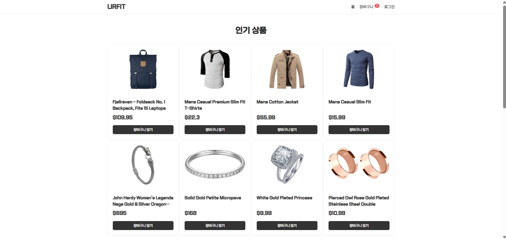
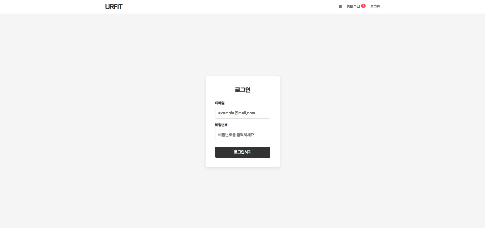
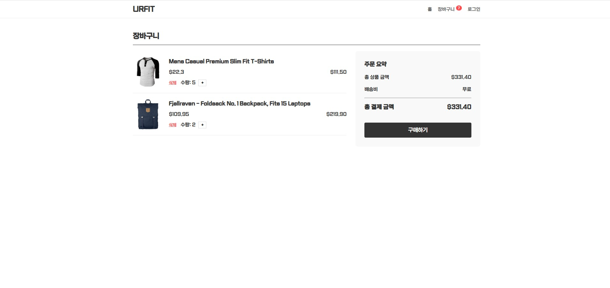

# React Shopping Mall Project
Redux를 활용한 사용자 친화적 쇼핑몰 웹사이트

### [Tech Stack]
React, Redux Toolkit, React Router, CSS Modules, Axios, FakeStoreAPI

### [Key Features]
1. Redux Toolkit을 활용한 데이터 관리
    상품 목록, 장바구니, 로그인 상태 등 컴포넌트에서 공통으로 사용하는 데이터가 많기 때문에 Redux Toolkit을 활용해 데이터 흐름의 복잡성을 해결했습니다
2. Local Storage 동기화
    사용자가 브라우저를 새로고침하거나 껐다 켰을 때 데이터가 초기화되지 않도록 Local Storage 동기화를 통해 웹을 초기화해도 저장된 데이터를 다시 불러오는 로직을 구현했습니다
3. Axios를 활용해 Rest API로부터 상품 데이터를 비동기 호출했습니다 

### [Project Structure]
```text
shopping-mall/
 ┣ public/
 ┣ src/
 ┃ ┣ components/        # 모달, 나비게이션
 ┃ ┣ font/
 ┃ ┣ pages/
 ┃ ┃   ┣ Cart/          # 장바구니
 ┃ ┃   ┣ Home/          # 홈 화면
 ┃ ┃   ┣ Login/         # 로그인 페이지
 ┃ ┣ App.css
 ┃ ┣ App.jsx
 ┃ ┗ main.jsx
 ┣ .gitignore
 ┣ index.html
 ┣ package.json
 ┗ README.md
```

### [Preview]



